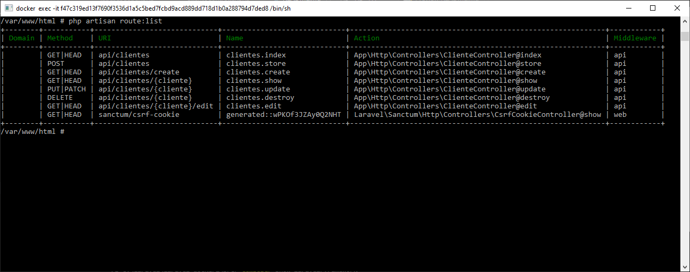
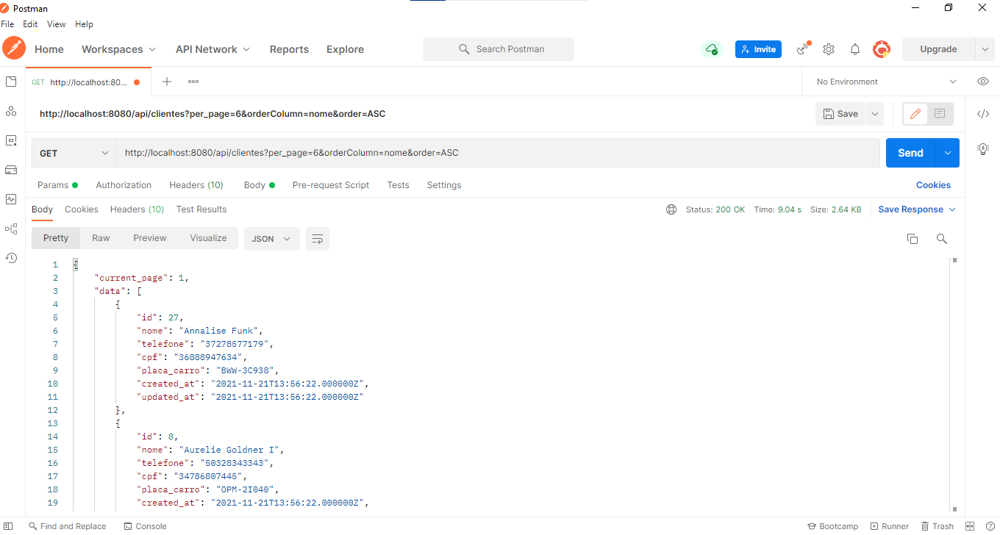

## Description 

Project of a REST API on PHP with Laravel framework, which allows creating, reading, updating and deleting (GET​, ​POST​, ​PUT​,DELETE​) records in a database and docker configuration

One can create, edit and delete customers.

Project was developed on PHP v7.4, Laravel v8.73.
